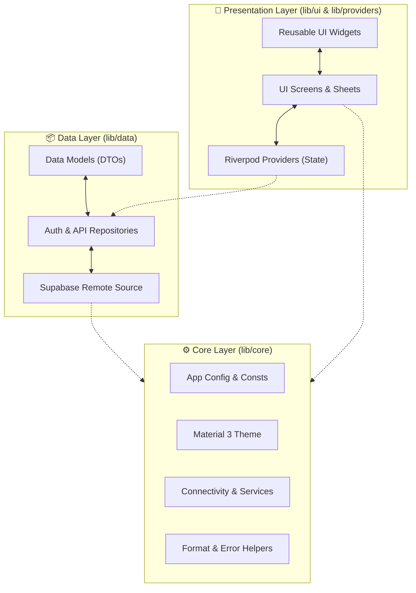

<div align="center">


# Sheress

### Multi-tenant financial reporting for Indonesian SMEs

A production-grade, offline-aware Flutter application that empowers business owners, managers, and staff with real-time financial insights, transaction tracking, debt management, QRIS payments, and multi-business oversight — all backed by Supabase.

<br />

[](https://flutter.dev)
[](https://dart.dev)
[](https://supabase.com)
[](https://opensource.org/licenses/MIT)
[](https://github.com/rohmansyah23/shress/pulls)

<br />

[](#-build)
[](#-table-of-contents)
[](#-preview)

---

</div>

<br />

## 📋 Quick Overview

<table>
<tr>
<td width="50%" valign="top">

### ⚙️ Technical Metadata
| Category | Value |
| :--- | :--- |
| 📱 **Platforms** | Android, Web |
| 🏗️ **Architecture** | Clean Architecture (Feature-driven) |
| ⚡ **State Management**| Riverpod |
| 🔥 **Backend** | Supabase |
| 🗄️ **Database** | PostgreSQL |
| 🔐 **Auth** | Custom (RPC-based) |
| 🌐 **Language** | Indonesian (`id_ID`) |
| 📦 **Version** | 1.4.0 |

</td>
<td width="50%" valign="top">

### 🎨 Features & Capabilities
| Category | Value |
| :--- | :--- |
| 🎨 **UI Framework** | Material 3 Design System |
| 🌙 **Theming** | Dynamic Dark & Light Mode (Harmonized 2-Theme System) |
| 📊 **Charts** | fl_chart (Interactive Visualizations) |
| 💳 **Payments** | Dynamic QRIS Integration |
| 🔔 **Notifications** | Local Reminders + FCM Push |
| 📶 **Offline Status**| Network Connectivity Overlay |
| 🏪 **Multi-Tenancy** | Role-Based Access Control (RBAC) |
| 🐛 **Monitoring** | Sentry Crash Reporting |
| 🔤 **Adaptive Text** | Font size setting (Small/Medium/Large) |

</td>
</tr>
</table>

<br />

## 📸 Preview

<div align="center">
  <p><em>Screenshots coming soon.</em></p>
</div>

---

## 📑 Table of Contents

- [About](#-about)
- [Features](#-features)
- [Architecture](#%EF%B8%8F-architecture)
- [Folder Structure](#-folder-structure)
- [Tech Stack](#%EF%B8%8F-tech-stack)
- [Screens](#-screens)
- [Getting Started](#-getting-started)
- [Environment Variables](#-environment-variables)
- [Configuration](#-configuration)
- [Packages](#-packages)
- [Performance](#-performance)
- [Security](#-security)
- [Testing](#-testing)
- [Build](#-build)
- [Roadmap](#-roadmap)
- [FAQ](#-faq)
- [Contributing](#-contributing)
- [License](#-license)
- [Author](#-author)
- [Acknowledgements](#-acknowledgements)

---

## 🎯 About

### The Problem
Most Indonesian SMEs (UMKM) still rely on manual bookkeeping — paper notebooks, spreadsheets, or scattered chats — leading to lost records, fragmented transaction histories, and zero real-time financial visibility.

### The Solution
Sheress provides a **cloud-first**, **role-based** financial platform that unifies transaction tracking, debt management, consignment monitoring, and QRIS payments under a single, cohesive, and beautiful application.

### Who Is This For?

| Role | Core Capabilities |
| :--- | :--- |
| 👔 **Business Owner** | Monitor multiple businesses, manage staff, view consolidated P&L reports, upload business QRIS. |
| 📊 **Manager** | Track daily transactions, manage debt entries, generate reports, register consignments. |
| 👤 **Staff** | Record daily income & expenses in real-time. |

---

## ✨ Features

<table>
<tr>
<td width="50%" valign="top">

#### 🔐 Authentication & Access
* **Role-Based Access Control (RBAC)**: Distinct permissions for Owner, Manager, and Staff.
* **Custom Auth**: Username-based login via Supabase RPC, JWT session stored locally.
* **Auto-Login**: Session persistence across app restarts via SharedPreferences.

#### 🏪 Multi-Business Management
* **Multi-Tenant Isolation**: Switch between different business entities seamlessly.
* **Independent Profiles**: Custom branding and data structure for each business.

#### 💰 Transaction Tracking
* **Income & Expenses**: Group by customizable categories.
* **Filters & Search**: Advanced filtering by dateRange, type, and search queries.
* **History Management**: Full CRUD operations for authorized roles.

#### 📊 Visual Reports
* **Profit & Loss (P&L)**: Real-time calculation of revenue, costs, and net profit margins.
* **Interactive Charts**: Responsive charts for trends, category splits, and comparisons.

#### 📱 Push Notifications
* **Firebase Cloud Messaging (FCM)**: Owner-to-staff push notifications via Supabase Edge Functions.
* **Activity Logs**: Auto-generated CUD logs for transactions, debts, and consignments with swipe-to-delete.
* **Token Lifecycle**: Auto-registration on login, deactivation on logout.
* **Foreground Handling**: Push notifications displayed as local notifications when app is open.

</td>
<td width="50%" valign="top">

#### 🎨 Modern Design System & Proportional Hierarchy
* **Icon-Only Floating Bottom Navbar**: Modern 64px glassmorphic pill navbar with active indicator glowing dot & adaptive text scale support.
* **Proportional Design System**: Harmonized font scale (`22px` Hero, `18px` Modals, `16px` Section Titles matching AppBars, `14px` Cards, `11-12px` Badges).
* **Personalized AppBar Headers**: Dynamic user greeting (`Halo, {Nama} 👋`) with subtitle roles and 100% Bahasa Indonesia consistency across all screens.
* **Smooth Rounded Dropdown Menus**: 16px rounded popup menus across all dropdown filters, role selectors, and forms.
* **Keyboard-Aware Auto-Scrolling**: Nominal and amount input fields automatically scroll into view (`Scrollable.ensureVisible`) above the onscreen keyboard when focused.
* **Harmonized Empty States**: High-contrast pure white titles in Dark Mode paired with subtle slate secondary descriptions.

#### 🔤 Adaptive Amount Text & Font Size
* **Composable Scaling**: App font size setting (Small/Medium/Large) multiplies with system accessibility scaling.
* **Overflow-Safe**: Monetary values use `nowrap` + ellipsis instead of auto-shrinking — no layout surprises.
* **User Preference**: Persisted via SharedPreferences, toggled from Settings.

#### 💳 QRIS Integration
* **Dynamic Code Display**: Instant access to payment QR codes for customers.
* **Formats Supported**: Render high-quality SVG and PNG files with local caching.

#### 📋 Debt & Consignments
* **Debtor Directory**: Detailed tracking of outstanding reseller balances.
* **Consignment Register**: Track inventory, sales, and consignor payouts dynamically.

</td>
</tr>
</table>

---

## 🏗️ Architecture

Sheress follows **Clean Architecture** combined with a **feature-driven** organization to ensure separation of concerns, complete testability, and high maintainability.



---

## 📁 Folder Structure

```text
lib/
├── main.dart                              # 🚀 App entry point
│
├── firebase_options.dart                      # 📱 Auto-generated Firebase config
│
├── core/                                  # ⚙️ Shared Infrastructure & Utilities
│   ├── config/                            #     Environment & app config
│   ├── constants/                         #     App-wide constants
│   ├── network/                           #     Connectivity monitoring
│   ├── qris/                              #     QRIS image handling
│   ├── services/                          #     Platform services (Notification, Sentry, FCM)
│   ├── theme/                             #     Material 3 theming & typography tokens
│   │   ├── app_icon_size.dart
│   │   ├── app_radius.dart
│   │   ├── app_spacing.dart
│   │   ├── app_typography.dart
│   │   └── app_theme.dart
│   ├── utils/                             #     Shared helpers
│   └── widgets/                           #     Reusable UI components
│       ├── adaptive_amount_text.dart
│       ├── error_widgets.dart
│       ├── finance_bar_chart.dart
│       ├── global_error_boundary.dart
│       ├── offline_overlay.dart
│       ├── shared_widgets.dart            #     PfBottomNav, PfEmptyState, PfButton
│       ├── summary_card.dart
│       └── trend_chart.dart
│
├── data/                                  # 📦 Data Access Layer
│   ├── local/models/                      #     Data models (9 entities)
│   └── remote/                            #     Remote repositories & API clients
│
├── providers/                             # 🔄 Riverpod State Management
│
└── ui/                                    # 🎨 Presentation Layer (UI Screens)
    ├── auth/                              #     Authentication & passwords
    ├── business_detail/                   #     Business profile and QRIS
    ├── category/                          #     Category list & CRUD
    ├── consignments/                      #     Consignment & reseller lists
    ├── dashboard/                         #     P&L summaries & transaction records
    ├── debtors/                           #     Debt directory and payments
    ├── manager/                           #     Manager-specific dashboard
    ├── onboarding/                        #     Interactive onboarding flow
    ├── owner/                             #     Business creator, staff managers, push notifications
    ├── profile/                           #     User settings & profile
    ├── reports/                           #     Consolidated statistics & PDF exports
    ├── settings/                          #     Theme mode and local notification controls
    ├── splash/                            #     App startup checker
    └── transaction/                       #     Income & expense sheets
```

---

## 🛠️ Tech Stack

| Tool/Library | Role | Why It Was Chosen |
| :--- | :--- | :--- |
| **[Flutter](https://flutter.dev)** | Framework | Expressive UI and native compilation on Android/Web. |
| **[Dart](https://dart.dev)** | Language | Type-safe, compile-time performance, and modern features. |
| **[Riverpod](https://riverpod.dev)** | State Management | Compile-safe state caching, lifecycle monitoring, and testability. |
| **[Supabase](https://supabase.com)** | Backend-as-a-Service | Open-source relational DB (PostgreSQL) with built-in RLS policies. |
| **PostgreSQL** | Database | Relational integrity for ledger systems; powerful constraint engine. |
| **[Firebase](https://firebase.google.com)** | Push Notifications | FCM for owner-to-staff messaging via Edge Functions. |
| **[fl_chart](https://flchart.dev)** | Visual Graphs | Highly performant chart rendering optimized for Flutter views. |
| **[Sentry](https://sentry.io)** | Error Logging | Automated stack trace collection and user impact analytics. |
| **connectivity_plus** | Network Listener | Detects connection changes to prompt local cache overrides. |

---

## 🚀 Getting Started

### Prerequisites

* **Flutter SDK**: `3.12.0` or higher (`flutter --version`)
* **Dart SDK**: `3.12.0` or higher (`dart --version`)
* **Java Development Kit (JDK)**: JDK 17 (for Android build tools)
* **Supabase Instance**: Active project URL and anonymous API keys.

### Installation

```bash
# 1. Clone the repository
git clone https://github.com/rohmansyah23/shress.git
cd shress

# 2. Retrieve Flutter dependency packages
flutter pub get

# 3. Setup configuration variables
cp .env.template .env

# 4. Compile and launch the app in debug mode
flutter run
```

---

## 📦 Build

### Android Split APKs

```bash
# Build split APKs per ABI (reduces download size)
flutter build apk --split-per-abi
```

Generated split APKs location: `build/app/outputs/flutter-apk/`

---

## 📄 License

This project is licensed under the terms of the **MIT License**.

---

## 👨‍💻 Author

<div align="center">

**Built with ❤️ by [rohmansyah23](https://github.com/rohmansyah23)**

</div>
