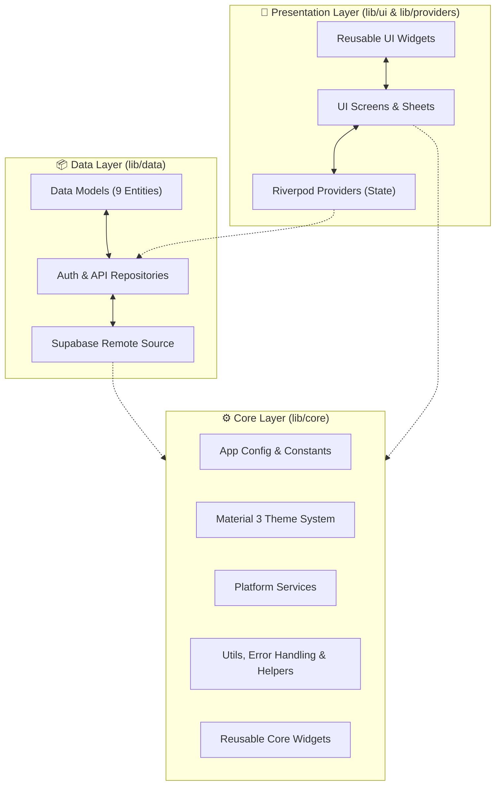

<div align="center">


# Sheress

### Multi-tenant financial reporting for Indonesian SMEs

A production-grade, offline-aware Flutter application that empowers business owners, managers, and staff with real-time financial insights, transaction tracking, debt management, QRIS payments, and multi-business oversight — all backed by Supabase.

<br />

[](https://flutter.dev)
[](https://dart.dev)
[](https://supabase.com)
[](https://opensource.org/licenses/MIT)
[](https://github.com/rohmansyah23/shress/pulls)

<br />

[](#-build)
[](#-table-of-contents)

---

</div>

<br />

## 📋 Quick Overview

<table>
<tr>
<td width="50%" valign="top">

### ⚙️ Technical Metadata
| Category | Value |
| :--- | :--- |
| 📱 **Platforms** | Android, Web |
| 🏗️ **Architecture** | Clean Architecture (Feature-driven) |
| ⚡ **State Management**| Riverpod |
| 🔥 **Backend** | Supabase |
| 🗄️ **Database** | PostgreSQL |
| 🔐 **Auth** | Custom (RPC-based JWT) |
| 🌐 **Language** | Indonesian (`id_ID`) |
| 📦 **Version** | 1.1.0+2 |

</td>
<td width="50%" valign="top">

### 🎨 Features & Capabilities
| Category | Value |
| :--- | :--- |
| 🎨 **UI Framework** | Material 3 Design System |
| 🌙 **Theming** | Dynamic Dark & Light Mode |
| 📊 **Charts** | fl_chart (Interactive Visualizations) |
| 💳 **Payments** | Dynamic QRIS Integration |
| 🔔 **Notifications** | Local Reminders + FCM Push |
| 📶 **Offline Status**| Network Connectivity Overlay |
| 🏪 **Multi-Tenancy** | Role-Based Access Control (RBAC) |
| 🐛 **Monitoring** | Sentry Crash Reporting |
| 🔤 **Adaptive Text** | Font size setting (Small/Medium/Large) |
| 📦 **Data Export** | CSV, Excel, SQL, JSON Backup |

</td>
</tr>
</table>

<br />

---

## 📑 Table of Contents

- [About](#-about)
- [Features](#-features)
- [Architecture](#%EF%B8%8F-architecture)
- [Folder Structure](#-folder-structure)
- [Tech Stack](#%EF%B8%8F-tech-stack)
- [Getting Started](#-getting-started)
- [Environment Variables](#-environment-variables)
- [Configuration](#-configuration)
- [Build](#-build)
- [Packages](#-packages)
- [Testing](#-testing)
- [Security](#-security)
- [Performance](#-performance)
- [Roadmap](#-roadmap)
- [FAQ](#-faq)
- [Contributing](#-contributing)
- [License](#-license)
- [Author](#-author)
- [Acknowledgements](#-acknowledgements)

---

## 🎯 About

### The Problem
Most Indonesian SMEs (UMKM) still rely on manual bookkeeping — paper notebooks, spreadsheets, or scattered chats — leading to lost records, fragmented transaction histories, and zero real-time financial visibility.

### The Solution
Sheress provides a **cloud-first**, **role-based** financial platform that unifies transaction tracking, debt management, consignment monitoring, and QRIS payments under a single, cohesive, and beautiful application.

### Who Is This For?

| Role | Core Capabilities |
| :--- | :--- |
| 👔 **Business Owner** | Monitor multiple businesses, manage staff, view consolidated P&L reports, upload business QRIS, send push notifications, manage categories, view activity logs. |
| 📊 **Manager** | Track daily transactions, manage debt entries, generate reports, register consignments, view staff notifications. |
| 👤 **Staff** | Record daily income & expenses in real-time, view assigned business data. |

---

## ✨ Features

<table>
<tr>
<td width="50%" valign="top">

#### 🔐 Authentication & Access
* **Role-Based Access Control (RBAC)**: Distinct permissions for Owner, Manager, and Staff.
* **Custom Auth**: Username-based login via Supabase RPC (`verify_public_password`), JWT session stored locally.
* **Auto-Login**: Session persistence across app restarts via SharedPreferences.
* **Force Logout**: Owner can invalidate user sessions by incrementing `session_version`.

#### 🏪 Multi-Business Management
* **Multi-Tenant Isolation**: Switch between different business entities seamlessly.
* **Independent Profiles**: Custom branding, QRIS images, and data structure for each business.
* **Quick Switching**: Recently selected businesses remembered for fast access.

#### 💰 Transaction Tracking
* **Income & Expenses**: Group by customizable categories with COGS (HPP) tracking.
* **Payment Methods**: Cash, Transfer, and QRIS payment options.
* **Filters & Search**: Advanced filtering by date range, type, payment method, and parsed search queries.
* **History Management**: Full CRUD operations with paginated loading for authorized roles.

#### 📊 Visual Reports
* **Profit & Loss (P&L)**: Real-time calculation of revenue, COGS, gross profit, expenses, and net profit margins.
* **Interactive Charts**: Responsive bar charts and trend lines for daily/weekly/monthly/yearly comparisons.
* **Per-Business & Combined**: View reports for individual businesses or consolidated across all.

#### 📋 Debt Management (Piutang)
* **Debtor Directory**: Detailed tracking of outstanding reseller/customer balances.
* **Partial Payments**: Track multiple payments against a single debt with automatic status updates.
* **Status Tracking**: Automatic `unpaid` → `partial` → `paid` status transitions.
* **Linked Transactions**: Debt creation and payment linked to expense/income transactions.

</td>
<td width="50%" valign="top">

#### 📦 Consignment Management (Titipan)
* **Consignor Directory**: Track consignment partners with contact details.
* **Daily & Reseller Types**: Support for different consignment workflows.
* **Item Tracking**: Quantity tracking per consignment item.
* **Sales Reporting**: Track consignment sales with date-based filtering.
* **Auto-Commission**: Settlement with automatic commission calculation.

#### 💳 QRIS Integration
* **Dynamic Code Display**: Instant access to payment QR codes for customers.
* **Upload Support**: Upload QRIS SVG images to Supabase Storage.
* **Offline-First Resolution**: Priority loading from Supabase Storage → local SVG assets → network URL fallback.
* **SVG Rendering**: High-quality SVG display via `flutter_svg`.

#### 📱 Push Notifications
* **Firebase Cloud Messaging (FCM)**: Owner-to-staff push notifications via Supabase Edge Functions.
* **Scheduled Reminders (pg_cron)**: Automatic daily recap reminders at 17.00/18.00/19.00 WIB to all active staff & managers — reminding them to submit the daily closing report by 20.00 WIB.
* **Activity Logs**: Auto-generated CUD (Create/Update/Delete) logs for transactions, debts, and consignments.
* **Token Lifecycle**: Auto-registration on login, refresh on token change, deactivation on logout.
* **Foreground Handling**: Push notifications displayed as local notifications when app is open.

#### 🔔 Local Notifications
* **Daily Reminders**: Configurable transaction reminder notifications.
* **Android 13+/14+ Support**: Proper permission handling for exact alarms.
* **Timezone Aware**: Asia/Jakarta timezone for accurate scheduling.

#### 📦 Data Backup & Export
* **JSON Backup**: Full database export as structured JSON.
* **SQL Backup**: Complete SQL dump for database restoration.
* **CSV Export**: Tabular data export for spreadsheet analysis.
* **Excel Export**: Styled `.xlsx` files with formatted headers and auto-fit columns.
* **Schema Export**: Database schema extraction from bundled migration assets.
* **Share Integration**: Share files directly via device share sheet.

#### 🎨 Modern Design System
* **Material 3**: Complete dual-theme system (Light & Dark) with semantic color tokens.
* **Harmonized Typography**: Google Fonts Inter with proportional scale (`22px` Hero → `11px` Badges).
* **Icon-Only Bottom Navbar**: Modern glassmorphic pill navbar with active indicator.
* **Keyboard-Aware Scrolling**: Input fields auto-scroll above keyboard on focus.
* **Adaptive Font Size**: User-selectable Small/Medium/Large, composed with system accessibility scaling.

</td>
</tr>
</table>

---

## 🏗️ Architecture

Sheress follows **Clean Architecture** combined with a **feature-driven** organization to ensure separation of concerns, testability, and maintainability.



---

## 📁 Folder Structure

```text
lib/
├── main.dart                              # 🚀 App entry point
├── firebase_options.dart                  # 📱 Auto-generated Firebase config
│
├── core/                                  # ⚙️ Shared Infrastructure & Utilities
│   ├── config/                            #     Environment & app config
│   │   └── app_config.dart
│   ├── constants/                         #     App-wide constants
│   │   └── constants.dart
│   ├── network/                           #     Connectivity monitoring
│   │   └── connectivity_service.dart
│   ├── qris/                              #     QRIS image handling & upload
│   │   ├── qris_resolver.dart
│   │   └── qris_upload_service.dart
│   ├── services/                          #     Platform services
│   │   ├── backup_service.dart            #       JSON/SQL backup & restore
│   │   ├── export_service.dart            #       CSV & Excel export
│   │   ├── fcm_service.dart               #       Firebase Cloud Messaging
│   │   ├── notification_service.dart      #       Local notifications & reminders
│   │   └── sentry_service.dart            #       Sentry crash reporting
│   ├── theme/                             #     Material 3 theming & design tokens
│   │   ├── app_icon_size.dart
│   │   ├── app_radius.dart
│   │   ├── app_spacing.dart
│   │   ├── app_theme.dart
│   │   └── app_typography.dart
│   ├── utils/                             #     Shared helpers
│   │   ├── error_handler.dart             #       Typed error handling (AppError)
│   │   ├── format_helpers.dart            #       Currency & date formatting
│   │   ├── notif_log.dart                 #       Notification logging
│   │   └── search_query_parser.dart       #       Advanced search parsing
│   └── widgets/                           #     Reusable UI components
│       ├── adaptive_amount_text.dart
│       ├── app_badge.dart
│       ├── error_widgets.dart
│       ├── finance_bar_chart.dart
│       ├── global_error_boundary.dart
│       ├── offline_overlay.dart
│       ├── recent_transaction_tile.dart
│       ├── report_widgets.dart
│       ├── shared_widgets.dart            #       PfBottomNav, PfEmptyState, PfButton
│       ├── summary_card.dart
│       └── trend_chart.dart
│
├── data/                                  # 📦 Data Access Layer
│   ├── local/models/                      #     Data models (9 entities)
│   │   ├── business_model.dart
│   │   ├── category_model.dart
│   │   ├── consignment_model.dart
│   │   ├── consignor_model.dart
│   │   ├── debt_model.dart
│   │   ├── debt_payment_model.dart
│   │   ├── debtor_model.dart
│   │   ├── transaction_model.dart
│   │   └── user_model.dart
│   └── remote/                            #     Remote repositories & API clients
│       ├── auth_repository.dart
│       └── supabase_service.dart
│
├── providers/                             # 🔄 Riverpod State Management (12 providers)
│   ├── auth_provider.dart
│   ├── business_providers.dart
│   ├── debt_consignment_provider.dart
│   ├── debtor_provider.dart
│   ├── font_size_provider.dart
│   ├── notification_provider.dart
│   ├── paginated_list_provider.dart
│   ├── query_cache_provider.dart
│   ├── recent_selected_businesses_provider.dart
│   ├── theme_provider.dart
│   ├── transaction_list_provider.dart
│   └── transaction_provider.dart
│
└── ui/                                    # 🎨 Presentation Layer (UI Screens)
    ├── auth/                              #     Authentication & passwords
    │   ├── forgot_password_screen.dart
    │   ├── login_screen.dart
    │   └── widgets/auth_text_field.dart
    ├── business_detail/                   #     Business profile and QRIS
    │   └── business_detail_screen.dart
    ├── consignments/                      #     Consignment & reseller management
    │   ├── add_consignment_screen.dart
    │   ├── consignment_detail_screen.dart
    │   ├── consignor_detail_screen.dart
    │   ├── consignors_screen.dart
    │   └── report_sales_screen.dart
    ├── dashboard/                         #     P&L summaries & QRIS display
    │   ├── dashboard_screen.dart
    │   ├── qris_display_screen.dart
    │   └── qris_upload_screen.dart
    ├── debtors/                           #     Debt directory and payments
    │   ├── add_debt_screen.dart
    │   ├── debtor_detail_screen.dart
    │   └── debtors_screen.dart
    ├── manager/                           #     Manager-specific views
    │   ├── manager_dashboard_screen.dart
    │   ├── manager_shell.dart
    │   └── staff_notification_screen.dart
    ├── owner/                             #     Owner admin panel (12 screens)
    │   ├── create_business_screen.dart
    │   ├── owner_activity_logs_screen.dart
    │   ├── owner_businesses_tab.dart
    │   ├── owner_category_management_screen.dart
    │   ├── owner_consignors_screen.dart
    │   ├── owner_dashboard_tab.dart
    │   ├── owner_debtors_screen.dart
    │   ├── owner_history_screen.dart
    │   ├── owner_shell.dart
    │   ├── send_notification_screen.dart
    │   ├── user_form_screen.dart
    │   └── user_management_panel.dart
    ├── profile/                           #     User settings & profile
    │   └── profile_screen.dart
    ├── reports/                           #     Consolidated statistics
    │   ├── manager_report_screen.dart
    │   └── owner_report_screen.dart
    ├── settings/                          #     Theme mode and notification controls
    │   └── settings_screen.dart
    ├── splash/                            #     App startup checker
    │   └── splash_screen.dart
    ├── transaction/                       #     Income & expense CRUD
    │   ├── edit_transaction_page.dart
    │   ├── transaction_history_screen.dart
    │   └── transaction_sheet.dart
    └── widgetbook/                        #     Design system component catalog
        └── widgetbook_screen.dart
```

---

## 🛠️ Tech Stack

| Tool/Library | Role | Why It Was Chosen |
| :--- | :--- | :--- |
| **[Flutter](https://flutter.dev)** | Framework | Expressive UI and native compilation on Android/Web. |
| **[Dart](https://dart.dev)** | Language | Type-safe, compile-time performance, and modern features. |
| **[Riverpod](https://riverpod.dev)** | State Management | Compile-safe state caching, lifecycle monitoring, and testability. |
| **[Supabase](https://supabase.com)** | Backend-as-a-Service | Open-source relational DB (PostgreSQL) with built-in RLS policies. |
| **[PostgreSQL](https://www.postgresql.org)** | Database | Relational integrity for ledger systems; powerful constraint engine. |
| **[Firebase](https://firebase.google.com)** | Push Notifications | FCM for owner-to-staff messaging via Edge Functions. |
| **[fl_chart](https://flchart.dev)** | Charts | Highly performant chart rendering optimized for Flutter views. |
| **[Sentry](https://sentry.io)** | Error Logging | Automated stack trace collection and user impact analytics. |
| **[connectivity_plus](https://pub.dev/packages/connectivity_plus)** | Network Listener | Detects connection changes for offline status overlay. |
| **[flutter_dotenv](https://pub.dev/packages/flutter_dotenv)** | Environment Config | Loads `.env` variables for Supabase and app configuration. |
| **[flutter_svg](https://pub.dev/packages/flutter_svg)** | SVG Rendering | High-quality QRIS image display. |
| **[google_fonts](https://pub.dev/packages/google_fonts)** | Typography | Inter font runtime download for consistent design. |
| **[shared_preferences](https://pub.dev/packages/shared_preferences)** | Local Storage | Persistent key-value storage for auth tokens and user preferences. |
| **[flutter_local_notifications](https://pub.dev/packages/flutter_local_notifications)** | Local Notifications | Daily reminders and FCM foreground display. |
| **[share_plus](https://pub.dev/packages/share_plus)** | File Sharing | Share backups and exports via device share sheet. |
| **[excel](https://pub.dev/packages/excel)** | Excel Export | Generate styled `.xlsx` files with formatted headers. |

---

## 🚀 Getting Started

### Prerequisites

* **Flutter SDK**: `3.12.2` or higher (`flutter --version`)
* **Dart SDK**: `3.12.2` or higher (`dart --version`)
* **Java Development Kit (JDK)**: JDK 17 (for Android build tools)
* **Supabase Account**: Active project with URL and anon key ([supabase.com](https://supabase.com))
* **Firebase Account**: Project with FCM enabled ([firebase.google.com](https://firebase.google.com))

### Installation

```bash
# 1. Clone the repository
git clone https://github.com/rohmansyah23/shress.git
cd shress

# 2. Install Flutter dependencies
flutter pub get

# 3. Setup environment variables
cp .env.template .env
# Edit .env with your Supabase and Firebase credentials

# 4. Run the app
flutter run
```

### Supabase Setup

1. Create a new project on [Supabase](https://supabase.com)
2. Run the initial migration SQL from `supabase/migrations/20260718000000_initial_schema.sql`
3. Apply subsequent migrations in order (the migration `20260802000000_add_recap_reminder_cron.sql` schedules the daily recap reminders via pg_cron at 17.00/18.00/19.00 WIB)
4. Copy your Project URL and Anon Key to `.env`
5. Deploy Edge Functions: `supabase functions deploy`
6. Set the `JWT_SECRET` and `FIREBASE_SERVICE_ACCOUNT` environment variables for the deployed functions

### Firebase Setup

1. Create a new project on [Firebase Console](https://console.firebase.google.com)
2. Enable Cloud Messaging (FCM)
3. Download `google-services.json` and place it in `android/app/`
4. Run `flutterfire configure` to generate `firebase_options.dart`

---

## 📦 Environment Variables

Copy `.env.template` to `.env` and fill in the values:

| Variable | Description | Example |
| :--- | :--- | :--- |
| `SUPABASE_URL` | Your Supabase project URL | `https://xxx.supabase.co` |
| `SUPABASE_ANON_KEY` | Supabase anonymous/public API key | `eyJhbG...` |
| `SUPABASE_SERVICE_ROLE_KEY` | Service role key (server-side only, do not expose) | `eyJhbG...` |
| `SUPABASE_DATABASE_URL` | Direct PostgreSQL connection string (for migrations) | `postgresql://...` |
| `APP_NAME` | Application display name | `Sheress` |
| `APP_VERSION` | Application version string | `1.1.0` |
| `APP_ENVIRONMENT` | Runtime environment | `development` / `production` |
| `SYNC_INTERVAL_SECONDS` | Offline sync interval (seconds) | `30` |
| `SYNC_BATCH_SIZE` | Offline sync batch size | `50` |
| `QRIS_CACHE_DAYS` | QRIS image cache duration (days) | `30` |

---

## ⚙️ Configuration

### Theme Mode
Users can switch between **System**, **Light**, and **Dark** themes from the Settings screen. Preference is persisted via SharedPreferences.

### Font Size
Three font size options available: **Small**, **Medium**, (default), and **Large**. The selected size is composed with the system's accessibility font scaling.

### Notifications
- **Daily Reminders**: Configurable time for daily transaction reminders (default: disabled).
- **Push Notifications**: FCM token auto-registered on login, deactivated on logout.

---

## 📦 Build

### Android Split APKs

```bash
# Build split APKs per ABI (reduces download size)
flutter build apk --split-per-abi
```

Generated split APKs location: `build/app/outputs/flutter-apk/`

### Web

```bash
flutter build web
```

---

## 📦 Packages

### Core Dependencies

| Package | Version | Purpose |
| :--- | :--- | :--- |
| `flutter_riverpod` | ^2.6.1 | State management |
| `supabase_flutter` | ^2.16.0 | Supabase backend integration |
| `firebase_core` | ^3.8.1 | Firebase initialization |
| `firebase_messaging` | ^15.1.6 | Push notifications (FCM) |
| `flutter_dotenv` | ^5.2.1 | Environment variable loading |
| `connectivity_plus` | ^6.1.1 | Network connectivity monitoring |
| `shared_preferences` | ^2.5.5 | Persistent key-value storage |

### UI & Visualization

| Package | Version | Purpose |
| :--- | :--- | :--- |
| `fl_chart` | ^0.69.2 | Interactive charts and graphs |
| `flutter_svg` | ^2.0.17 | SVG rendering (QRIS images) |
| `google_fonts` | ^6.2.1 | Inter font runtime download |
| `image_picker` | ^1.2.3 | QRIS image upload from gallery/camera |

### Services & Utilities

| Package | Version | Purpose |
| :--- | :--- | :--- |
| `sentry` | ^9.24.0 | Crash reporting (pure Dart) |
| `flutter_local_notifications` | ^22.0.1 | Local notification scheduling |
| `intl` | ^0.20.2 | Indonesian date/number formatting |
| `path_provider` | ^2.1.5 | File system path access |
| `timezone` | ^0.11.1 | Asia/Jakarta timezone support |
| `share_plus` | ^13.2.1 | File sharing via share sheet |
| `excel` | ^4.0.0 | Excel (.xlsx) file generation |

### Dev Dependencies

| Package | Version | Purpose |
| :--- | :--- | :--- |
| `flutter_test` | SDK | Testing framework |
| `flutter_lints` | ^6.0.0 | Lint rules |
| `flutter_launcher_icons` | ^0.14.3 | App icon generation |

---

## 🧪 Testing

The test suite currently consists of **integration tests** that run against a live Supabase backend. There are no unit tests or widget tests yet.

### Test Files

| File | Type | Description |
| :--- | :--- | :--- |
| `test/widget_test.dart` | Smoke Test | Minimal placeholder — verifies `SheressApp` class is not null. |
| `test/test_jwt_rpc.dart` | Integration | Tests the full JWT authentication flow: user creation, login, token verification, tampered token rejection, and force logout via `session_version`. |
| `test/test_owner_cud_notifications.dart` | Integration | Tests the owner CUD notification pipeline: creates test data, performs INSERT/UPDATE/DELETE on transactions/debts/consignments, verifies `owner_activity_logs` entries, and confirms self-action skip. |

### Running Tests

```bash
# Run all tests
flutter test

# Note: Integration tests require a live Supabase instance
# Ensure .env is configured with valid SUPABASE_URL, SUPABASE_ANON_KEY,
# and SUPABASE_SERVICE_ROLE_KEY before running integration tests.
```

### Test Coverage Status
- **Models**: Not tested
- **Providers**: Not tested
- **Services**: Not tested (integration tests cover Supabase interactions indirectly)
- **UI Widgets**: Not tested
- **Auth Flow**: Covered by `test_jwt_rpc.dart`
- **CUD Notifications**: Covered by `test_owner_cud_notifications.dart`

---

## 🔒 Security

### Authentication
* **Custom JWT Auth**: Username-based login via Supabase RPC (`verify_public_password`), returns signed JWT token.
* **Session Persistence**: JWT stored in SharedPreferences, verified on app restart via `verify_user_jwt` RPC.
* **Session Invalidation**: Force logout by incrementing `session_version` in the database — old tokens are rejected.

### Authorization
* **Role-Based Access Control (RBAC)**: Three roles with distinct permissions:
  * **Owner**: Full access — manage businesses, users, categories, view all data, send notifications.
  * **Manager**: Manage transactions, debts, consignments, generate reports.
  * **Staff**: Record transactions only.
* **Supabase Row Level Security (RLS)**: Database-level policies enforce data isolation.

### Data Protection
* **Service Role Key**: Stored in `.env` for server-side use only — never exposed to client code.
* **Environment Variables**: Sensitive config loaded via `flutter_dotenv`, not hardcoded.
* **Sentry**: Crash reports include user context and breadcrumbs for debugging, but no sensitive data is logged.

### Force Logout
Owners can force-logout any user by calling the `increment_session_version` RPC, which invalidates all active tokens for that user.

---

## ⚡ Performance

### Offline Awareness
* **Connectivity Monitoring**: Real-time network status via `connectivity_plus` with online/offline stream.
* **Offline Overlay**: Visual banner when device is offline, preventing failed operations.

### Data Loading
* **Paginated Queries**: `PaginatedListNotifier<T>` generic provider for efficient large-dataset loading.
* **Query Cache**: `QueryCacheProvider` optimizes repeated Supabase queries by caching results.
* **Recent Businesses**: Quickly switch between recently accessed businesses without re-fetching.

### Local Storage
* **SharedPreferences**: Auth tokens, theme preference, font size, and notification settings persisted locally.
* **QRIS Caching**: SVG images cached locally for specified duration (`QRIS_CACHE_DAYS`).

### Error Handling
* **Typed Errors**: `AppError` class with `ErrorHandler.guard()` for consistent error propagation.
* **Global Error Boundary**: Catches unhandled exceptions and displays user-friendly error UI.

---

## 🗺️ Roadmap

Based on current development plans in `docs/`:

| Feature | Status | Description |
| :--- | :--- | :--- |
| **AI Financial Analysis** | Planned | Groq API integration for automated financial summaries, risk detection, and insights. |
| **WhatsApp Integration** | Draft | Automatic transaction recording from WhatsApp Group messages. |
| **Font Size Fixes** | In Progress | Improvements to `AdaptiveAmountText` — removing font shrinking, using ellipsis instead. |
| **Force Logout UI** | Complete | Owner UI for force-logging out users via `session_version` increment. |

---

## ❓ FAQ

### How do I set up the development environment?
Follow the [Getting Started](#-getting-started) section. You need Flutter 3.12.2+, a Supabase project, and a Firebase project.

### Why does the app use custom auth instead of Supabase Auth?
Sheress uses a custom RPC-based auth flow (`verify_public_password`) to support username-based login (not just email), which is more common for Indonesian SME users.

### Can I use this app offline?
The app detects connectivity and shows an offline overlay. While core data operations require a network connection, the app gracefully handles connectivity loss and caches preferences locally.

### How do I backup my data?
Go to Settings → Backup. You can export data as JSON, SQL, CSV, or Excel files and share them via your device's share sheet.

### How do I add a new business?
As an Owner, go to the Businesses tab → Create Business. Fill in the business name, description, and optionally upload a QRIS image.

### How do push notifications work?
Owners can send push notifications to staff/manager users. Additionally, CUD (Create/Update/Delete) operations on transactions, debts, and consignments automatically generate activity log notifications. A scheduled reminder (pg_cron) also fires automatically at 17.00, 18.00, and 19.00 WIB to all active staff & managers, with a 20.00 WIB final deadline for the daily closing report.

### What databases/tables does Sheress use?
Sheress uses PostgreSQL via Supabase with tables for: `users`, `businesses`, `user_businesses`, `categories`, `transactions`, `debtors`, `debts`, `debt_payments`, `consignors`, `consignments`, `consignment_items`, `consignment_settlements`, `push_tokens`, `owner_activity_logs`, and `owner_notifications`.

---

## 🤝 Contributing

Contributions are welcome! Please follow these steps:

1. **Fork** the repository
2. **Create** a feature branch (`git checkout -b feature/amazing-feature`)
3. **Commit** your changes (`git commit -m 'Add amazing feature'`)
4. **Push** to the branch (`git push origin feature/amazing-feature`)
5. **Open** a Pull Request

### Code Style
* Follow Dart's official [style guide](https://dart.dev/guides/language/effective-dart/style)
* Use `flutter_lints` rules defined in `analysis_options.yaml`
* Write clear commit messages in English or Indonesian

### Development Guidelines
* Keep features isolated in their respective `ui/`, `providers/`, and `data/` directories
* Use Riverpod providers for state management
* Handle errors using `ErrorHandler.guard()` from `core/utils/error_handler.dart`
* Format currency using helpers from `core/utils/format_helpers.dart`

---

## 📄 License

This project is licensed under the **MIT License** — see the [LICENSE](LICENSE) file for details.

---

## 👨‍💻 Author

<div align="center">

**Built with ❤️ by [rohmansyah23](https://github.com/rohmansyah23)**

</div>

---

## 🙏 Acknowledgements

* [Flutter](https://flutter.dev) — Beautiful, native apps for any screen
* [Supabase](https://supabase.com) — Open source Firebase alternative
* [Riverpod](https://riverpod.dev) — Safe, scalable, and maintainable state management
* [fl_chart](https://flchart.dev) — Powerful Flutter chart library
* [Sentry](https://sentry.io) — Application monitoring and error tracking
* [Firebase](https://firebase.google.com) — Cloud platform for push notifications
* [Google Fonts](https://fonts.google.com) — Inter typeface for clean, modern UI
