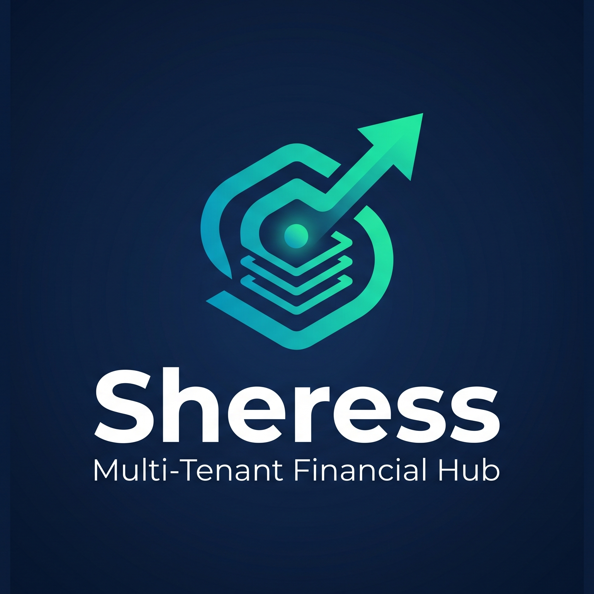
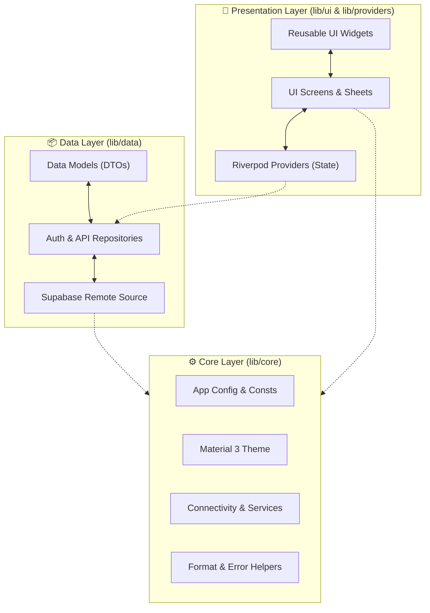

<div align="center">



# Sheress

### Multi-tenant financial reporting for Indonesian SMEs

A production-grade, offline-aware Flutter application that empowers business owners, managers, and staff with real-time financial insights, transaction tracking, debt management, QRIS payments, and multi-business oversight — all backed by Supabase.

<br />

[](https://flutter.dev)
[](https://dart.dev)
[](https://supabase.com)
[](https://opensource.org/licenses/MIT)
[](https://github.com/rohmansyah23/shress/pulls)

<br />

[](#-build)
[](#-table-of-contents)
[](#-preview)

---

</div>

<br />

## 📋 Quick Overview

<table>
<tr>
<td width="50%" valign="top">

### ⚙️ Technical Metadata
| Category | Value |
| :--- | :--- |
| 📱 **Platforms** | Android, Web |
| 🏗️ **Architecture** | Clean Architecture (Feature-driven) |
| ⚡ **State Management**| Riverpod |
| 🔥 **Backend** | Supabase |
| 🗄️ **Database** | PostgreSQL |
| 🔐 **Auth** | Custom (RPC-based) |
| 🌐 **Language** | Indonesian (`id_ID`) |
| 📦 **Version** | 1.0.0 |

</td>
<td width="50%" valign="top">

### 🎨 Features & Capabilities
| Category | Value |
| :--- | :--- |
| 🎨 **UI Framework** | Material 3 Design System |
| 🌙 **Theming** | Dynamic Dark & Light Mode |
| 📊 **Charts** | fl_chart (Interactive Visualizations) |
| 💳 **Payments** | Dynamic QRIS Integration |
| 🔔 **Notifications** | Local Reminders + FCM Push |
| 📶 **Offline Status**| Network Connectivity Overlay |
| 🏪 **Multi-Tenancy** | Role-Based Access Control (RBAC) |
| 🐛 **Monitoring** | Sentry Crash Reporting |
| 🔤 **Adaptive Text** | Auto-sizing monetary display |

</td>
</tr>
</table>

<br />

## 📸 Preview

<div align="center">
  <p><em>App screenshots and demo coming soon.</em></p>
  
  
  
  
</div>

> [!TIP]
> Replace the placeholder images above with actual screenshots inside the `docs/images/` folder.

---

## 📑 Table of Contents

- [About](#-about)
- [Features](#-features)
- [Architecture](#%EF%B8%8F-architecture)
- [Folder Structure](#-folder-structure)
- [Tech Stack](#%EF%B8%8F-tech-stack)
- [Screens](#-screens)
- [Getting Started](#-getting-started)
- [Environment Variables](#-environment-variables)
- [Configuration](#-configuration)
- [Packages](#-packages)
- [Performance](#-performance)
- [Security](#-security)
- [Testing](#-testing)
- [Build](#-build)
- [Roadmap](#-roadmap)
- [FAQ](#-faq)
- [Contributing](#-contributing)
- [License](#-license)
- [Author](#-author)
- [Acknowledgements](#-acknowledgements)

---

## 🎯 About

### The Problem
Most Indonesian SMEs (UMKM) still rely on manual bookkeeping — paper notebooks, spreadsheets, or scattered chats — leading to lost records, fragmented transaction histories, and zero real-time financial visibility.

### The Solution
Sheress provides a **cloud-first**, **role-based** financial platform that unifies transaction tracking, debt management, consignment monitoring, and QRIS payments under a single, cohesive, and beautiful application.

### Who Is This For?

| Role | Core Capabilities |
| :--- | :--- |
| 👔 **Business Owner** | Monitor multiple businesses, manage staff, view consolidated P&L reports, upload business QRIS. |
| 📊 **Manager** | Track daily transactions, manage debt entries, generate reports, register consignments. |
| 👤 **Staff** | Record daily income & expenses in real-time. |

---

## ✨ Features

<table>
<tr>
<td width="50%" valign="top">

#### 🔐 Authentication & Access
* **Role-Based Access Control (RBAC)**: Distinct permissions for Owner, Manager, and Staff.
* **Custom Auth**: Username-based login via Supabase RPC, JWT session stored locally.
* **Auto-Login**: Session persistence across app restarts via SharedPreferences.

#### 🏪 Multi-Business Management
* **Multi-Tenant Isolation**: Switch between different business entities seamlessly.
* **Independent Profiles**: Custom branding and data structure for each business.

#### 💰 Transaction Tracking
* **Income & Expenses**: Group by customizable categories.
* **Filters & Search**: Advanced filtering by dateRange, type, and search queries.
* **History Management**: Full CRUD operations for authorized roles.

</td>
<td width="50%" valign="top">

#### 📊 Visual Reports
* **Profit & Loss (P&L)**: Real-time calculation of revenue, costs, and net profit margins.
* **Interactive Charts**: Responsive charts for trends, category splits, and comparisons.

#### 📱 Push Notifications
* **Firebase Cloud Messaging (FCM)**: Owner-to-staff push notifications via Supabase Edge Functions.
* **Token Lifecycle**: Auto-registration on login, deactivation on logout.
* **Foreground Handling**: Push notifications displayed as local notifications when app is open.

#### 🔤 Adaptive Amount Text
* **Auto-Sizing**: Monetary values automatically shrink to fit available width.
* **Step-Down Sizes**: 32pt → 20pt → 15pt → 14pt cascade for long numbers.

#### 💳 QRIS Integration
* **Dynamic Code Display**: Instant access to payment QR codes for customers.
* **Formats Supported**: Render high-quality SVG and PNG files with local caching.

#### 📋 Debt & Consignments
* **Debtor Directory**: Detailed tracking of outstanding reseller balances.
* **Consignment Register**: Track inventory, sales, and consignor payouts dynamically.

</td>
</tr>
</table>

---

## 🏗️ Architecture

Sheress follows **Clean Architecture** combined with a **feature-driven** organization to ensure separation of concerns, complete testability, and high maintainability.



### Layer Breakdown

| Layer | Purpose | Key Components |
| :--- | :--- | :--- |
| ⚙️ **Core** | Shared infrastructure, configs, global themes, and utility classes. | `AppConfig`, `AppTheme`, `ErrorHandler`, `FormatHelpers`, `Constants` |
| 📦 **Data** | Serialization models (DTOs), remote service adapters, and database interfaces. | `SupabaseService`, `AuthRepository`, 9 serialization models |
| 🔄 **Providers** | Business logic flow and reactive state bindings via Riverpod. | `AuthProvider`, `TransactionProvider`, `ThemeProvider`, `DebtorProvider` |
| 🎨 **UI** | Widget components and feature-specific layout screens. | 15+ UI modules, 30+ pages, custom styling widgets |

---

## 📁 Folder Structure

```text
lib/
├── main.dart                              # 🚀 App entry point
│
├── firebase_options.dart                      # 📱 Auto-generated Firebase config
│
├── core/                                  # ⚙️ Shared Infrastructure & Utilities
│   ├── config/                            #     Environment & app config
│   │   └── app_config.dart
│   ├── constants/                         #     App-wide constants
│   │   └── constants.dart
│   ├── network/                           #     Connectivity monitoring
│   │   └── connectivity_service.dart
│   ├── qris/                              #     QRIS image handling
│   │   ├── qris_resolver.dart
│   │   └── qris_upload_service.dart
│   ├── services/                          #     Platform services (Notification, Sentry, FCM)
│   │   ├── notification_service.dart
│   │   ├── fcm_service.dart
│   │   └── sentry_service.dart
│   ├── theme/                             #     Material 3 theming & sizes
│   │   ├── app_icon_size.dart
│   │   ├── app_radius.dart
│   │   ├── app_spacing.dart
│   │   └── app_theme.dart
│   ├── utils/                             #     Shared helpers
│   │   ├── error_handler.dart
│   │   └── format_helpers.dart
│   └── widgets/                           #     Reusable UI components
│       ├── adaptive_amount_text.dart
│       ├── error_widgets.dart
│       ├── finance_bar_chart.dart
│       ├── global_error_boundary.dart
│       ├── offline_overlay.dart
│       ├── shared_widgets.dart
│       ├── summary_card.dart
│       └── trend_chart.dart
│
├── data/                                  # 📦 Data Access Layer
│   ├── local/
│   │   └── models/                        #     Data models (9 entities)
│   │       ├── business_model.dart
│   │       ├── category_model.dart
│   │       ├── consignment_model.dart
│   │       ├── consignor_model.dart
│   │       ├── debt_model.dart
│   │       ├── debt_payment_model.dart
│   │       ├── debtor_model.dart
│   │       ├── transaction_model.dart
│   │       └── user_model.dart
│   └── remote/                            #     Remote repositories & API clients
│       ├── auth_repository.dart
│       └── supabase_service.dart
│
├── providers/                             # 🔄 Riverpod State Management
│   ├── auth_provider.dart
│   ├── business_providers.dart
│   ├── debt_consignment_provider.dart
│   ├── debtor_provider.dart
│   ├── notification_provider.dart
│   ├── paginated_list_provider.dart
│   ├── query_cache_provider.dart
│   ├── theme_provider.dart
│   ├── transaction_list_provider.dart
│   └── transaction_provider.dart
│
└── ui/                                    # 🎨 Presentation Layer (UI Screens)
    ├── auth/                              #     Authentication & passwords
    ├── business_detail/                   #     Business profile and QRIS
    ├── category/                          #     Category list & CRUD
    ├── consignments/                      #     Consignment & reseller lists
    ├── dashboard/                         #     P&L summaries & transaction records
    ├── debtors/                           #     Debt directory and payments
    ├── manager/                           #     Manager-specific dashboard
    ├── onboarding/                        #     Interactive onboarding flow
    ├── owner/                             #     Business creator, staff managers, push notifications
    │   ├── send_notification_screen.dart
    ├── profile/                           #     User settings & profile
    ├── reports/                           #     Consolidated statistics & PDF exports
    ├── settings/                          #     Theme mode and local notification controls
    ├── splash/                            #     App startup checker
    └── transaction/                       #     Income & expense sheets
```

---

## 🛠️ Tech Stack

| Tool/Library | Role | Why It Was Chosen |
| :--- | :--- | :--- |
| **[Flutter](https://flutter.dev)** | Framework | Expressive UI and native compilation on Android/Web. |
| **[Dart](https://dart.dev)** | Language | Type-safe, compile-time performance, and modern features. |
| **[Riverpod](https://riverpod.dev)** | State Management | Compile-safe state caching, lifecycle monitoring, and testability. |
| **[Supabase](https://supabase.com)** | Backend-as-a-Service | Open-source relational DB (PostgreSQL) with built-in RLS policies. |
| **PostgreSQL** | Database | Relational integrity for ledger systems; powerful constraint engine. |
| **[Firebase](https://firebase.google.com)** | Push Notifications | FCM for owner-to-staff messaging via Edge Functions. |
| **[fl_chart](https://flchart.dev)** | Visual Graphs | Highly performant chart rendering optimized for Flutter views. |
| **[Sentry](https://sentry.io)** | Error Logging | Automated stack trace collection and user impact analytics. |
| **connectivity_plus** | Network Listener | Detects connection changes to prompt local cache overrides. |

---

## 📱 Screens

| Module | Purpose | Role Permissions |
| :--- | :--- | :--- |
| 🚀 **Splash** | Restores state sessions and checks internet connections. | All |
| 🔐 **Login & Recover** | Secure password log-in and password resets via email links. | All |
| 📋 **Onboarding** | Wizard guiding owners to create their first business and profile. | All |
| 📊 **Owner Board** | Aggregated reports for all managed businesses, revenue charts. | Owner |
| 📊 **Manager Board** | Focused daily stats for the assigned business. | Manager |
| 📝 **Ledger History** | Paginated lists of cash activities with date filters. | Owner, Manager |
| ➕ **Transaction Sheet** | Add/edit/delete income or expense logs. | Owner, Manager, Staff |
| 🏪 **Manage Businesses**| Register and modify business names, structures, and assets. | Owner |
| 📤 **QRIS Configuration**| Upload new QRIS layout images to Supabase storage buckets. | Owner |
| 👥 **Debtor Directory** | Track debtors list, log payments, and view due dates. | Owner, Manager |
| 📦 **Consignments** | Register consignment transactions, daily stocks, and sales. | Owner, Manager |
| 📈 **P&L Reports** | Periodically calculated P&L statements with charts. | Owner, Manager |
| 👥 **Staff Management** | Invite, update, or revoke access roles for employees. | Owner |
| 📤 **Send Notification** | Compose and push notifications to staff via FCM. | Owner |
| ⚙️ **Settings** | Toggle Theme Mode and schedule notification reminders. | All |

---

## 🚀 Getting Started

### Prerequisites

Verify that your local system has these programs installed:

* **Flutter SDK**: `3.12.0` or higher (`flutter --version`)
* **Dart SDK**: `3.12.0` or higher (`dart --version`)
* **Java Development Kit (JDK)**: JDK 17 (for Android build tools)
* **Supabase Instance**: Active project URL and anonymous API keys.

### Installation

Follow these steps to run the application locally:

```bash
# 1. Clone the repository
git clone https://github.com/rohmansyah23/shress.git
cd shress

# 2. Retrieve Flutter dependency packages
flutter pub get

# 3. Setup configuration variables
cp .env.template .env
# Open .env in your text editor and fill in your Supabase variables.

# 4. Compile and launch the app in debug mode
flutter run
```

### Demo Credentials

You can test roles out of the box using our seeded demo credentials:

| Account Role | Username | Password |
| :--- | :--- | :--- |
| 👔 **Owner Account** | `owner` | `password123` |
| 📊 **Manager Account**| `manager` | `password123` |
| 👤 **Staff Account** | `staff` | `password123` |

---

## 🔧 Environment Variables

Create a `.env` file in your root folder. Use the template below:

```env
# ─── Supabase Backend (Required) ──────────────────
SUPABASE_URL=https://your-project-id.supabase.co
SUPABASE_ANON_KEY=your-supabase-anon-key

# ─── Crash Reporting (Optional) ────────────────────
SENTRY_DSN=your-sentry-dsn

# ─── Application Configuration ─────────────────────
APP_NAME=Sheress
APP_ENVIRONMENT=development

# ─── Caching & Synchronization ─────────────────────
SYNC_INTERVAL_SECONDS=30
SYNC_BATCH_SIZE=50
QRIS_CACHE_DAYS=30
```

> [!WARNING]
> Keep your `.env` private and never commit it to source control. It is already included in our `.gitignore`.

---

## ⚙️ Configuration

<details>
<summary>🤖 <strong>Android Engine Details</strong></summary>

<br />

| Property | Target Value |
| :--- | :--- |
| **Minimum SDK** | `24` (Android 7.0) |
| **Target SDK** | `34` (Android 14.0) |
| **Application Package ID**| `com.sheress.app` |
| **Kotlin Version** | `2.0.21` |
| **Android Gradle Plugin** | `9.0.1` |
| **Firebase** | `google-services.json` configured |

</details>

<details>
<summary>🌐 <strong>Web Application Details</strong></summary>

<br />

| Property | Configuration File |
| :--- | :--- |
| **PWA Manifest Settings** | `web/manifest.json` |
| **Deep Link Scheme** | `sheress://reset-password` |

</details>

<details>
<summary>🗄️ <strong>PostgreSQL Migrations (25 steps)</strong></summary>

<br />

The database relies on sequential migration files located in the `supabase/migrations/` folder to set up schema structures, constraints, and Row Level Security:

| Index | Migration Name | Focus area |
| :--- | :--- | :--- |
| **001** | `initial_schema` | Creates primary user, business, category, and ledger tables. |
| **002** | `qris_storage_bucket` | Initializes Supabase storage buckets for hosting QRIS images. |
| **003** | `demo_accounts` | Seeds standard accounts for demo verification. |
| **004** | `public_passwords` | Sets up secure password checking triggers. |
| **005** | `update_rls_policies` | Activates Row Level Security on tables. |
| **006** | `public_auth` | Configures auth handler routines. |
| **007** | `drop_unused_policies` | Removes redundant access routines. |
| **008** | `allow_anon_rls` | Custom rules for anonymous logins (first onboarding step). |
| **009** | `insert_demo_users` | Populates demo schemas with seed data. |
| **010** | `username_login` | Migrates authentication from emails to custom usernames. |
| **011** | `qris_mime_types` | Restricts QRIS uploads to image MIME files only. |
| **012** | `fix_qris_storage_policies` | Sets up read/write policies on storage directories. |
| **013** | `simplify_qris_storage_policies`| Optimizes bucket RLS checks. |
| **014** | `drop_financial_reports` | Drops legacy pre-compiled reports in favor of dynamic widgets. |
| **015** | `add_debts_and_consignment` | Creates debt trackers, reseller tables, and consignment logs. |
| **016** | `grant_debt_consignment_permissions` | Adds RLS permissions for staff and managers on debt logs. |
| **017** | `consignment_two_models` | Separates consignments into daily records and reseller records. |
| **018** | `enable_realtime_consignment` | Connects Supabase Realtime tracking to consignment updates. |
| **019** | `fix_categories_unique` | Ensures category names are unique per business entity. |
| **020** | `migrate_debt_to_reseller` | Restructures older debt columns into the modern reseller model. |
| **021** | `integrate_debt_transactions` | Automates transaction creation when debt payments are cleared. |
| **022** | `push_tokens_and_notifications` | Creates `push_tokens` and `owner_notifications` tables. |
| **023** | `fix_rls_push_tokens_and_notifications` | Drops old auth.uid() policies, creates anon_all. |
| **024** | `grant_push_tokens_permissions` | Grants SELECT/INSERT/UPDATE/DELETE to `anon` role. |
| **025** | `grant_service_role_push_tokens` | Grants SELECT/INSERT/UPDATE/DELETE to `service_role`. |

</details>

---

## 📦 Packages

We use these package dependencies to build a production-ready application:

* **[flutter_riverpod](https://pub.dev/packages/flutter_riverpod)**: Compile-safe, reactive state caching.
* **[supabase_flutter](https://pub.dev/packages/supabase_flutter)**: Connects authentication, storage buckets, and Postgres tables.
* **[firebase_core](https://pub.dev/packages/firebase_core)**: Core Firebase initialization.
* **[firebase_messaging](https://pub.dev/packages/firebase_messaging)**: FCM push notification handling.
* **[fl_chart](https://pub.dev/packages/fl_chart)**: High-performance data graphs.
* **[sentry_flutter](https://pub.dev/packages/sentry_flutter)**: Real-time telemetry, crash reports, and runtime exceptions.
* **[flutter_local_notifications](https://pub.dev/packages/flutter_local_notifications)**: Local task scheduling and daily entry reminders.
* **[connectivity_plus](https://pub.dev/packages/connectivity_plus)**: Detects internet connections to trigger network indicators.
* **[flutter_svg](https://pub.dev/packages/flutter_svg)**: Vector rendering of QRIS codes.
* **[shared_preferences](https://pub.dev/packages/shared_preferences)**: Stores local theme settings and session tokens.

---

## ⚡ Performance

To ensure smooth performance on all devices, we implemented these optimizations:
* **Paginated Loading**: Built a generic `PaginatedListNotifier` to query transactions, debts, and consignments in batches rather than loading full lists.
* **Cached Inquiries**: Integrated a `QueryCache` utility with custom Time-To-Live (TTL) policies to avoid duplicate backend API requests.
* **Widget Lifecycle Boundaries**: Used `const` declarations across the UI hierarchy to reduce rebuild counts.
* **Lazy Initialization**: Configured feature-based loaders to launch pages only when requested.
* **Global Error Isolation**: Bound the top-level tree in a `GlobalErrorBoundary` to catch runtime rendering errors and display a clean fallback screen rather than crashing.

---

## 🔒 Security

* **Row Level Security (RLS)**: PostgreSQL enforces data isolation at the database level. Users cannot access data belonging to other businesses.
* **Role-Based Access Control**: API queries are restricted. For instance, staff users are blocked from viewing P&L charts or deleting businesses.
* **Encrypted Sessions**: JWT sessions are managed securely by Supabase and refreshed automatically on the device.
* **Sanitized Logs**: Sentry configurations filter and remove sensitive parameters (e.g., user passwords) before shipping stack traces.

---

## 🧪 Testing

```bash
# Execute all local test suites
flutter test

# Run tests and output coverage data
flutter test --coverage

# Generate and view HTML coverage reports
genhtml coverage/lcov.info -o coverage/html
open coverage/html/index.html
```

Currently, the app contains basic widget smoke tests (`test/widget_test.dart`). Expanding test coverage for repositories, view models, and providers is planned for future updates.

---

## 📦 Build

### Android

```bash
# Build a debug APK
flutter build apk --debug

# Build a release APK
flutter build apk --release

# Build split APKs per ABI (reduces download size)
flutter build apk --split-per-abi
```

### Web

```bash
# Build the production web bundle
flutter build web --release --web-renderer canvaskit

# Build with a custom web base path
flutter build web --release --base-href="/sheress/"
```

### Supabase Edge Functions

```bash
# Deploy the owner push notification function
supabase functions deploy send-owner-notification
```

---

## 🗺️ Roadmap

- [x] Username-based login and authentication
- [x] Multi-business tenant switching
- [x] Dynamic visual P&L dashboards and ledger listings
- [x] Role-Based Access Control (Owner / Manager / Staff)
- [x] Custom QRIS vector image rendering
- [x] Debt tracking directory and consignment records
- [x] Local notification alerts and scheduled daily reminders
- [x] Global Exception Boundaries & Network Status Indicator
- [x] Sentry SDK monitoring integration
- [x] Push Notifications using Firebase Cloud Messaging (FCM)
- [x] Owner-to-staff push messaging via Edge Functions
- [x] Adaptive amount text for auto-sizing monetary display
- [ ] PDF report export and sharing features
- [ ] Multi-Language support (Localization for id_ID and en_US)
- [ ] Biometric login (FaceID / Fingerprint)
- [ ] OCR-based receipt scanning and automated input
- [ ] Offline database sync using local SQLite or Hive databases (v2)

---

## ❓ FAQ

<details>
<summary><strong>Why choose Supabase instead of Firebase?</strong></summary>

<br />

Supabase uses a relational **PostgreSQL database** with native **Row Level Security (RLS)**, making it highly secure and easy to implement multi-tenant data structures. It also provides transparent SQL queries and schemas out of the box, unlike Firebase's NoSQL document structure.

</details>

<details>
<summary><strong>Why is Riverpod preferred for state management?</strong></summary>

<br />

Riverpod is **compile-safe**, does **not require a BuildContext**, and makes caching and testing state incredibly straightforward. It avoids the boilerplates of Bloc while offering more safety than Provider.

</details>

<details>
<summary><strong>Can this app be used without an internet connection?</strong></summary>

<br />

Sheress monitors network states and prompts an offline overlay indicator when the connection drops. The app currently requires an active connection to write logs to Supabase, but local caching and offline database sync (v2) are planned for the future.

</details>

<details>
<summary><strong>How is multi-business data isolation secured?</strong></summary>

<br />

Every user is linked to a business entity with a designated role (Owner, Manager, Staff). Supabase's database enforces Row Level Security (RLS) policies on every query. If a user tries to query data without a valid membership, PostgreSQL rejects the request immediately.

</details>

---

## 🤝 Contributing

We welcome contributions to Sheress! Follow these steps to submit changes:

1. **Fork the Repository** on GitHub.
2. **Create a Feature Branch** (`git checkout -b feature/amazing-feature`).
3. **Commit Your Changes** using Conventional Commits guidelines (`git commit -m "feat: add amazing feature"`).
4. **Push to Your Fork** (`git push origin feature/amazing-feature`).
5. **Open a Pull Request** to our `main` branch.

### Commit Conventions

| Type | When to Use |
| :--- | :--- |
| `feat` | Adding a new feature |
| `fix` | Resolving a bug or issue |
| `docs` | Modifying documentation files |
| `style` | Layout formatting or styling changes without code modification |
| `refactor` | Restructuring internal code logic without changing feature behavior |
| `test` | Adding missing tests or correcting existing test files |
| `chore` | Maintenance tasks, library upgrades, or build script tweaks |

---

## 📄 License

This project is licensed under the terms of the **MIT License**.

```text
MIT License

Copyright (c) 2026 Sheress

Permission is hereby granted, free of charge, to any person obtaining a copy
of this software and associated documentation files (the "Software"), to deal
in the Software without restriction, including without limitation the rights
to use, copy, modify, merge, publish, distribute, sublicense, and/or sell
copies of the Software, and to permit persons to whom the Software is
furnished to do so, subject to the following conditions:

The above copyright notice and this permission notice shall be included in all
copies or substantial portions of the Software.

THE SOFTWARE IS PROVIDED "AS IS", WITHOUT WARRANTY OF ANY KIND, EXPRESS OR
IMPLIED, INCLUDING BUT NOT LIMITED TO THE WARRANTIES OF MERCHANTABILITY,
FITNESS FOR A PARTICULAR PURPOSE AND NONINFRINGEMENT. IN NO EVENT SHALL THE
AUTHORS OR COPYRIGHT HOLDERS BE LIABLE FOR ANY CLAIM, DAMAGES OR OTHER
LIABILITY, WHETHER IN AN ACTION OF CONTRACT, TORT OR OTHERWISE, ARISING FROM,
OUT OF OR IN CONNECTION WITH THE SOFTWARE OR THE USE OR OTHER DEALINGS IN THE
SOFTWARE.
```

---

## 👨‍💻 Author

<div align="center">

**Built with ❤️ by**

[](https://github.com/rohmansyah23)
[](https://linkedin.com/in/username)
[](https://yourportfolio.com)
[](mailto:your@email.com)

</div>

---

## 🙏 Acknowledgements

We want to thank the open-source community behind these excellent resources:

* [Flutter](https://flutter.dev) — Multi-platform application builder.
* [Supabase](https://supabase.com) — Open-source Backend-as-a-Service.
* [Riverpod](https://riverpod.dev) — Compile-safe state manager.
* [fl_chart](https://flchart.dev) — Visual graphic library.
* [Sentry](https://sentry.io) — Crash telemetry.
* [Google Fonts](https://fonts.google.com) — Inter typeface source.
* [Material Design 3](https://m3.material.io) — Visual design language.

<br />

<div align="center">

**Made with 🇮🇩 by Indonesian Developer**

⭐ **Star this repository if you find it useful!**

<br />

<sub>[Back to Top](#-quick-overview)</sub>

</div>
